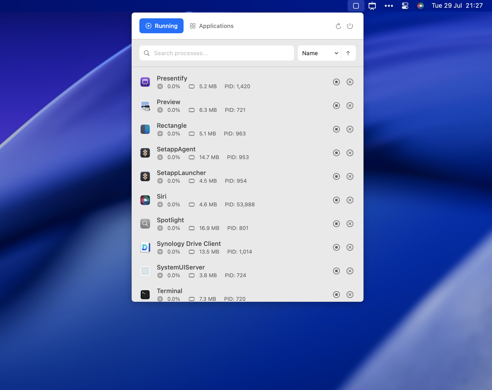
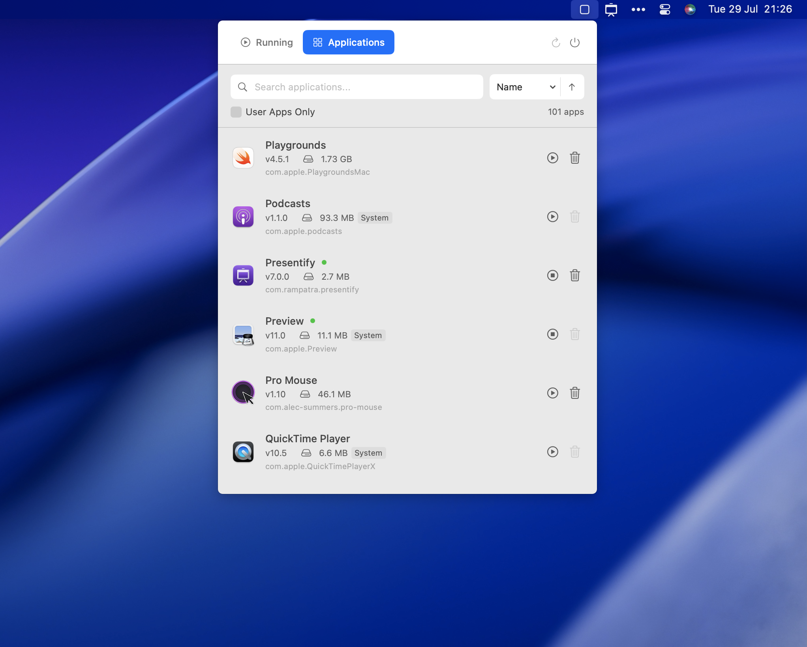

# MissionBar

<div align="center">
  
</div>

**MissionBar** is a powerful macOS menu bar application that provides comprehensive system monitoring and application management right from your menu bar. Monitor running processes, manage installed applications, and keep track of system resource usage with an elegant and intuitive interface.

## ✨ Features

### 🔄 Real-time Process Monitoring
- **Live Process Tracking**: Monitor all running processes with real-time updates every 2 seconds
- **Resource Usage**: View CPU usage percentages and memory consumption for each process
- **Process Management**: Safely terminate processes with confirmation dialogs
- **Smart Search**: Instantly filter processes by name with live search
- **Flexible Sorting**: Sort processes by name, CPU usage, or memory usage in ascending/descending order

### 📱 Application Management
- **Complete App Inventory**: Browse all installed applications on your system
- **Storage Analytics**: See how much disk space each application consumes
- **Version Information**: Check installed versions of your applications
- **Running Status**: Instantly identify which applications are currently active
- **Safe Uninstall**: Remove applications directly from the interface (when possible)

### 🎯 Clean Menu Bar Integration
- **Minimal Footprint**: Lives quietly in your menu bar without cluttering your dock
- **Native Design**: Beautiful SwiftUI interface that follows macOS design guidelines
- **Instant Access**: Quick access to system information with a single click
- **Smooth Animations**: Polished user experience with fluid transitions and hover effects

<div align="center">
  
</div>

## 🚀 Getting Started

### System Requirements
- macOS 13.0 (Ventura) or later
- 64-bit Intel or Apple Silicon Mac

### Installation

#### Option 1: Build from Source
1. Clone this repository:
   ```bash
   git clone https://github.com/rampatra/MissionBar.git
   cd MissionBar
   ```

2. Open `MissionBar.xcodeproj` in Xcode

3. Build and run the project (⌘+R)

#### Option 2: Download Release
*Coming soon - Check the [Releases](../../releases) page for pre-built binaries*

### First Launch
1. After launching, MissionBar will appear in your menu bar
2. Click the menu bar icon to open the interface
3. Grant necessary permissions if prompted (for process monitoring)
4. Start monitoring your system!

## 🎮 Usage

### Monitoring Running Processes
1. Click the MissionBar icon in your menu bar
2. The **Running** tab shows all active processes
3. Use the search box to filter processes by name
4. Click column headers to sort by name, CPU, or memory usage
5. Right-click on processes to terminate them (system processes are protected)

### Managing Applications
1. Switch to the **Applications** tab
2. Browse your complete application inventory
3. See storage usage and version information
4. Identify which apps are currently running
5. Uninstall applications when possible

### Refreshing Data
- Data refreshes automatically every 2 seconds
- Click the refresh button (🔄) for manual updates
- Use ⌘+R keyboard shortcut for quick refresh

## 🛠 Technology Stack

- **Language**: Swift
- **Framework**: SwiftUI
- **Architecture**: MVVM with ObservableObject
- **Platform**: macOS (Menu Bar Extra)
- **Minimum Target**: macOS 13.0

## 🤝 Contributing

Contributions are welcome! Here's how you can help:

1. **Fork the repository**
2. **Create a feature branch**: `git checkout -b feature/amazing-feature`
3. **Commit your changes**: `git commit -m 'Add amazing feature'`
4. **Push to the branch**: `git push origin feature/amazing-feature`
5. **Open a Pull Request**

### Development Setup
1. Ensure you have Xcode 14.0 or later installed
2. Clone the repository and open in Xcode
3. The project uses Swift Package Manager for dependencies
4. Build and test your changes before submitting

## 📝 License

This project is licensed under the MIT License - see the [LICENSE](LICENSE) file for details.

## 👨‍💻 About the Developer

MissionBar is created by **Ram Patra**, developer of productivity apps including:
- [**Presentify**](https://presentifyapp.com) - Screen annotation and presentation tool
- [**FaceScreen**](https://facescreenapp.com) - Add your face to screen recordings
- [**ToDoBar**](https://todobarapp.com) - Menu bar todo list
- [**SimpleFill**](https://simplefillapp.com) - Form filling automation

## 🐛 Issues & Support

Found a bug or have a feature request? Please check the [Issues](../../issues) page to see if it's already been reported. If not, feel free to create a new issue with:

- **Bug reports**: Include steps to reproduce, expected behavior, and system information
- **Feature requests**: Describe the feature and why it would be useful
- **Questions**: Use the discussion section for general questions

## ⭐ Show Your Support

If you find MissionBar useful, please consider:
- ⭐ Starring this repository
- 🐦 Sharing it on social media
- 🤝 Contributing to the project
- 💝 Recommending it to friends and colleagues

---

<div align="center">
  <p>Made with ❤️ for the macOS community</p>
  <p>
    <a href="https://github.com/rampatra">GitHub</a> •
    <a href="https://twitter.com/rampatra_">Twitter</a> •
    <a href="https://linkedin.com/in/ram-patra">LinkedIn</a>
  </p>
</div>

